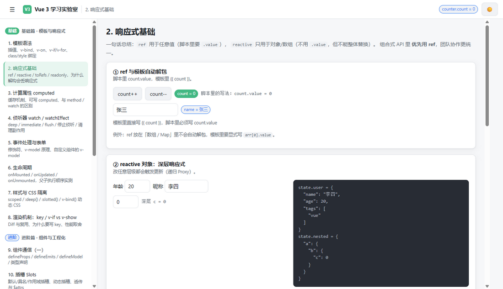
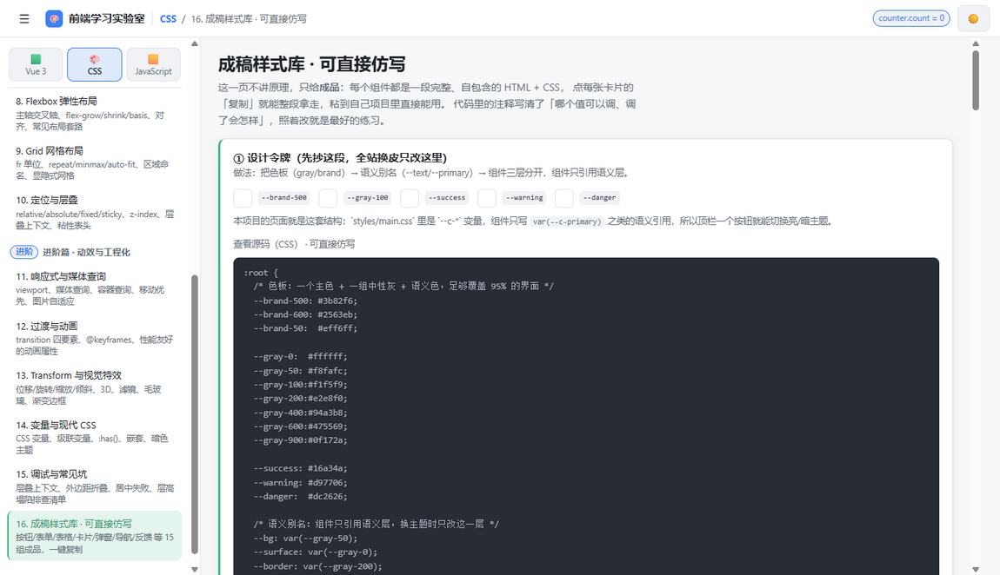

# 前端学习实验室（Vue 3 / CSS / JavaScript）

一个**可交互、可对照**的前端学习模板：三个独立实验台（Lab），共 **48 个演示页**，
每页都是能直接改、直接看效果的活代码，而不是静态文档。
其中 CSS 实验台还特意加了一页 **「成稿样式库」** —— 15 组完整组件（HTML + CSS）带一键复制，可以直接仿写。

| Lab | 页数 | 内容 |
|-----|------|------|
| 🟩 Vue 3 | 20 | 模板语法 → 响应式 → 组件通信/插槽/依赖注入/组合式函数 → 路由/Pinia/异步组件/过渡 → 性能/渲染函数/工程化 |
| 🎨 CSS | 16 | 层叠与选择器 → 盒模型/单位/文本/背景 → display 流/Flex/Grid/定位 → 响应式/动画/Transform/变量主题/调试 → **成稿样式库（可复制）** |
| 🟨 JavaScript | 12 | 变量类型/函数作用域/闭包 this/数组/对象/现代语法 → Promise/事件循环/原型 Class/模块与错误/DOM 事件/与 Vue 的桥梁 |

技术栈：Vue 3.5（`<script setup>` + TypeScript）+ Vue Router 4 + Pinia + Vite 6（含 `@vitejs/plugin-vue-jsx`）。
零 UI 库依赖 —— 样式全部自己写，方便看清每一处原理。亮/暗双主题，顶栏可切换。

---

## 快速开始

```bash
pnpm install      # 或 npm install / yarn
pnpm dev          # 开发服务器：http://localhost:5199
pnpm typecheck    # vue-tsc 类型检查
pnpm build        # 类型检查 + 生产构建（产物在 dist/）
pnpm preview      # 本地预览构建产物
```

打开 <http://localhost:5199>，左侧顶部是 **Lab 切换器**（🟩 Vue 3 / 🎨 CSS / 🟨 JavaScript），
切换后下方大纲会换成对应的学习路线，按顺序点下去即可。



---

## 想直接抄样式：看这一页

CSS 实验台的第 16 页 **「成稿样式库 · 可直接仿写」** 就是为「照着抄」准备的，
每张卡片都是**完整、自包含**的成品（不依赖本项目的变量，复制走就能用），并带「复制」按钮：

| # | 组件 | 里面包含 |
|---|------|---------|
| ① | 设计令牌 | 色板 → 语义别名 → 组件三层结构、间距/圆角/阴影阶梯、暗色主题覆盖方式 |
| ② | 布局原语 | `.stack` / `.cluster` / `.row-between` 三个万能类 |
| ③ | 文本样式表 | 标题/正文/次要/辅助四级排版 + 单行截断 + 多行 `line-clamp` |
| ④ | 按钮体系 | 5 种变体 × 3 种尺寸、`:focus-visible` 焦点环、禁用态、带 loading |
| ⑤ | 表单 | input/标签/提示/错误态、checkbox、**纯 CSS 开关 switch** |
| ⑥ | 表格 | 斑马纹、悬停高亮、数字列等宽右对齐、`table-wrap` 横向滚动 |
| ⑦ | 卡片 | 封面 + 内容 + 悬停浮起（只动 transform 与阴影） |
| ⑧ | 弹窗 | 遮罩 + `grid` 居中 + 头/体/尾分区 + 进出场动画 |
| ⑨ | 反馈 | alert 三态、badge 语义色、渐变进度条 |
| ⑩ | 空态与骨架屏 | shimmer 骨架屏、带「下一步动作」的空态 |
| ⑪ | tooltip | 纯 CSS 提示气泡（含小三角） |
| ⑫ | 折叠面板 | 原生 `details/summary` + 自定义箭头，零 JS |
| ⑬ | 导航与选项卡 | 导航栏（含 `margin-left:auto` 靠右）+ 底部高亮条的 tab |
| ⑭ | 后台布局骨架 | 侧栏 + sticky 顶栏 + `auto-fit` 卡片网格 |
| ⑮ | 微交互 | 浮起 / 按压缩放 / spinner / 流光骨架 |
| ⑯ | 仿写练习建议 | 「抄一遍 → 改一遍 → 补全状态 → 加响应式 → 自己造一个」 |



---

## 两个「教学基础设施」（本项目最值得借鉴的设计）

### 1. CSS 页的源码与真实样式**同源**

每个 CSS 演示卡片的「查看源码」不是手抄的字符串，而是
[`src/lib/cssSource.ts`](./src/lib/cssSource.ts) 在运行时从页面真实注入的 `<style scoped>` 里
提取并**去掉 `data-v-xxx` 属性**得到的：

```vue
const css = useStyleSource()
// ...
<CssCard title="Flex 主轴" :source="css.rules('.demo-flex')" copyable> ... </CssCard>
```

好处：改了样式，展示的代码立刻跟着变 —— **不可能出现「文档和实现不一致」**。

### 2. JS 页的「断言 + 可运行」

[`src/components/JsCard.vue`](./src/components/JsCard.vue) 让 JS 学习变成「结果 vs 期望」的对照：

```vue
<JsCard
  title="'==' 的隐式转换"
  :asserts="asserts1"          <!-- 常量定义在 <script setup> 里，见下面的注意事项 -->
  :runnable="runnable1"
/>
```

`asserts` 自动渲染 ✅/❌ 并标出期望值（全项目共 900+ 条断言）；
`runnable` 的「▶ 运行」用 `new Function` 就地执行，把 `console.log` 输出显示在卡片里
（**仅用于学习演示**，真实项目不要执行不可信字符串 —— 等价于 eval）。

---

## 目录结构

```
src/
├── main.ts                  # 应用入口：createApp → 插件 → 全局配置 → mount
├── App.vue                  # 布局：顶栏（Lab 标识 + Pinia 全局计数）+ 侧边栏 + 页面渲染
├── labs.ts                  # ★ 三个 Lab 的大纲 = 路由表数据源（单一数据源）
├── router/index.ts          # 由 labs.ts 自动生成路由 + 全局守卫 + 嵌套路由 + 404
├── stores/counter.ts        # Pinia：counter + todo 两个 setup store
├── composables/index.ts     # ★ useCounter / useMouse / useLocalStorage / useDebouncedRef / useFetch / useWindowSize
├── directives/index.ts      # 全局自定义指令：v-focus / v-permission / v-click-outside / v-highlight
├── plugins/i18n.ts          # 自定义插件示例（全局组件 + globalProperties + provide）
├── lib/cssSource.ts         # ★ CSS 页的「真实样式源码」提取工具
├── styles/main.css          # 设计变量（亮/暗主题）+ 通用样式（.card / .tag / .kv / pre.code …）
├── components/
│   ├── AppSidebar.vue       # 侧边栏 + Lab 切换器
│   ├── BaseCard.vue         # Vue 页的演示卡片
│   ├── CssCard.vue          # ★ CSS 页卡片（真实 CSS 源码区 + 一键复制）
│   ├── JsCard.vue           # ★ JS 页卡片（断言列表 + 可运行代码块）
│   └── …                    # 各页共用子组件（VirtualList / ModalDialog / SlotPanel / RenderCounter …）
└── pages/
    ├── vue/                 # Vue 实验台 20 页 + RouterUser / NotFound / RouterNested
    ├── css/                 # CSS 实验台 16 页（含 snippets.vue 成稿样式库）
    └── js/                  # JavaScript 实验台 12 页
```

**新增一个学习页只需两步**：在 `src/labs.ts` 里对应 Lab 的 `groups` 加一项（`name` 用 kebab-case），
再新建 `src/pages/<lab>/<name>.vue`。路由与侧边栏会自动生成
（`import.meta.glob('@/pages/css/*.vue')` 等按目录匹配组件）。

---

## 写页面时的约定（也是本模板踩过的坑）

1. **CSS 源码用 `css.rules('.前缀')`**：每个 CSS 页用自己的类名前缀，避免与其他页面串台。
2. **scoped 样式只认静态类名**：`class` 必须字面量出现在模板里；
   `:class="'prefix-' + x"` 这种动态拼接的类**不会带上 `data-v` 属性**，样式不生效。
3. **模板里展示代码要转义**：`<` → `&lt;`、`{{` → `&#123;&#123;`。
   反过来，**JS 表达式属性里不要写实体**（`&gt;`、`&#123;`）：Vue 解码后会破坏表达式解析。
4. **长表达式（断言数组等）定义在 `<script setup>` 里**，模板只写 `:asserts="asserts1"`。
   原因：HTML 属性里出现裸双引号会截断属性，而 `&#34;` 虽然运行时可用，`vue-tsc` 却解析不了。
5. **故意演示类型错误的代码**加 `// @ts-expect-error 教学演示：…`，而不是改掉语义 ——
   全项目共 35 处，`pnpm typecheck` 依然全绿。
6. **不要用 `route.matched` 取页面组件**：本项目环境里 `route.path` / `route.meta` 是响应的，
   但 `route.matched` 不跟着更新（会导致「路由变了页面不换」）。用响应式的 `route.name` 查表。
7. **不要用 `<Transition mode="out-in">` 包懒加载页面**：离场动画会和异步组件互相等待。
   页面入场动画改成挂在页面根节点上的 CSS keyframes（见 `App.vue`）。
8. **一个 SFC 只能 `defineEmits` 一次**（类型声明与运行时声明不能并存）。
9. **默认的 vue 是运行时版**：写 `template: '...'` 字符串模板不生效，
   需要 alias 到 `vue/dist/vue.esm-bundler.js`（见 `vite.config.ts` 注释）。
10. **用 `@/` 别名导入**，不用 `../` 相对路径 —— 既避免路径地狱，
    也规避「位于 `src` 根目录的文件用 `../` 被解析到项目根」这类解析歧义。

---

## 验证记录

| 项目 | 结果 |
|------|------|
| 全部 51 个 `.vue` 通过 Vite 编译 | ✅ 无编译错误 |
| 三个 Lab 的 48 条页面路由逐页渲染检查 | ✅ 全部正常，无 Vue 警告 / 运行时错误 |
| JS 页断言（900+ 条）与 runnable 实测 | ✅ 断言全绿，运行输出正常 |
| CSS 页「真实样式源码」提取 | ✅ 每页 3~6 个源码区，内容与页面样式同源 |
| `npx vue-tsc --noEmit` | ✅ exit 0 |
| `pnpm build` | ✅ 每页独立 chunk，主包 170 kB（gzip 67 kB） |

---

## 学完之后建议的练习

做一个「用户列表 + 待办」小应用，把三个 Lab 的知识串起来：

CSS（用样式库里的令牌 + 卡片 + 表格搭界面）→
JavaScript（fetch + `Promise.all` 取数据、数组方法做过滤/分组、防抖搜索）→
Vue（组合式函数封装请求、Pinia 共享状态、路由跳详情页、自定义指令控权限、异步组件懒加载图表）。

然后回头读官方文档，会顺畅很多：
[Vue 3 中文文档](https://cn.vuejs.org) ·
[Vue Router](https://router.vuejs.org) ·
[Pinia](https://pinia.vuejs.org) ·
[Vite](https://cn.vite.dev) ·
[MDN CSS](https://developer.mozilla.org/zh-CN/docs/Web/CSS) ·
[MDN JavaScript](https://developer.mozilla.org/zh-CN/docs/Web/JavaScript)
